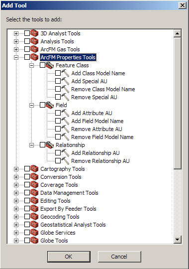

# ArcFM Properties Tools
A set of `ArcGIS Geoprocessing Tools` that allow you to perform common tasks within the `ArcFM Properties Manager` which can be added to a modle in `Model Builder` or run individually. 

## Model Name Geoprocessing Tools
These tools are used for adding or removing model names.
- `Add Class Model Name` - A geoprocessing tool used for adding class model names to an object class.
- `Add Field Model Name` - A geoprocessing tool used for adding field model names a field.
- `Remove Class Model Name` - A geoprocessing tool used for removing class model names from an object class.
- `Remove Field Model Name` - A geoprocessing tool used for removing field model names from a field.

## Auto Updater Geoprocessing Tools
These tools are used for adding or removing relationship, attribute or special auto updaters
- `Add Special AU` - A geoprocessing tool used for assigning a registered auto updates to an object class.
- `Add Relationship AU` - A geoprocessing tool used for assigning a registered auto updater to a relationship class.
- `Add Attribute AU` - A geoprocessing tool used for assigning a registered auto updater to a field.
- `Remove Special AU` - A geoprocessing tool used for unassigning an auto updater from an object class.
- `Remove Relationship AU` - A geoprocessing tool used for unassigning an auto updater from a relationship class.
- `Remove Attribute AU` - A geoprocessing tool used for unassigning an auto updaters from a field.